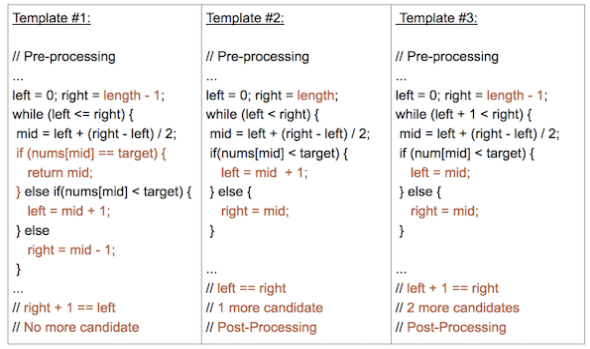

# 二分搜索
给一个**有序数组**和目标值，找**第一次**/**最后一次**/**任何一次**出现的索引，时间复杂度 O(logN)。

## 模板
常用的二分搜索模板有如下三种形式：

这三个模板的不同之处在于：
- 左、中、右索引的分配；
- 循环或递归终止的条件；
- 后处理的必要性；

模板#1和#3是最常用的。模板2更高级一些，用于解决某些特定类型的问题。

### 模板1（left <= right）
- 二分查找最基础和最基本的形式；
- 查找条件可以在不与元素的两侧进行比较的情况下确定（或使用它周围的特定元素）；
- 不需要后处理，因为每一步中，都在检查是否找到了元素。如果到达末尾，则未找到；

### 模板2（left < right）
- 一种实现二分查找的高级方法；
- 查找条件需要访问元素的直接右邻居；
- 使用元素的右邻居来确定是否满足条件，并决定是否向左还是向右；
- 保证查找空间在每一步中至少有2个元素；
- 需要进行后处理，当你剩下1个元素时，循环/递归结束，需要评估剩余元素是否符合条件；

### 模板3（left + 1 < right）
- 实现二分查找的另一种方法；
- 搜索条件需要访问元素的直接左右邻居；
- 使用元素的邻居来确定它是向左还是向右；
- 保证查找空间在每个步骤中至少有3个元素；
- 需要进行后处理。当剩下2个元素时，循环/递归结束，需要评估其余元素是否符合条件；

详细的对比可以参考 Leetcode 上的文章：[二分搜索模板](https://leetcode.cn/leetbook/read/binary-search/xewjg7/)

### 模板例题，[二分查找](https://leetcode.cn/problems/binary-search/)
```
给定一个 n 个元素有序的（升序）整型数组 nums 和一个目标值 target  ，写一个函数搜索 nums 中的 target，如果目标值存在返回下标，否则返回 -1。
```
- 如果是最简单的二分搜索，不需要找第一个、最后一个位置，或者是没有重复元素，可以使用模板 1，代码更简洁。同时，如果搜索失败，left 是第一个大于 target 的索引，right 是最后一个小于 target 的索引。
```cpp
class Solution {
public:
    int search(vector<int>& nums, int target) {
        int left = 0, right = nums.size() - 1;
        while (left <= right){
            int mid = left + ((right - left) >> 1);
            if (nums[mid] == target){
                return mid;
            }else if (nums[mid] < target){
                left = mid + 1;
            }else{
                right = mid - 1;
            }
        }
        return -1;
    }
};
```
- 模板2
```cpp
class Solution {
public:
    int search(vector<int>& nums, int target) {
        int left = 0, right = nums.size() - 1;
        while (left < right){
            int mid = left + ((right - left) >> 1);
            if (nums[mid] < target){
                left = mid + 1;
            }else{
                right = mid;
            }
        }
        return nums[left] == target ? left : -1;
    }
};
```
- 模板3
```cpp
class Solution {
public:
    int search(vector<int>& nums, int target) {
        int left = 0, right = nums.size() - 1;
        while (left + 1 < right){
            int mid = left + ((right - left) >> 1);
            if (nums[mid] < target){
                left = mid;
            }else{
                right = mid;
            }
        }
        if (nums[left] == target){
            return left;
        }else if (nums[right] == target){
            return right;
        }else{
            return -1;
        }
    }
};
```

## [在排序数组中查找元素的第一个和最后一个位置](https://leetcode.cn/problems/find-first-and-last-position-of-element-in-sorted-array/)
```
给定一个按照升序排列的整数数组 nums，和一个目标值 target。找出给定目标值在数组中的开始位置和结束位置。
如果数组中不存在目标值 target，返回 [-1, -1]。
```
- 模板2
```cpp
class Solution {
public:
    vector<int> searchRange(vector<int>& nums, int target) {
        vector<int> ans = {-1, -1};
        if (nums.size() == 0) {return ans;}
        int left = 0, right = nums.size() - 1;
        while (left < right){
            int mid = left + ((right - left) >> 1);
            if (nums[mid] < target){
                left = mid + 1;
            }else{
                right = mid;
            }
        }
        if (nums[left] == target){
            ans[0] = left;
        }else{
            return ans;
        }
        left = 0;
        right = nums.size() - 1;
        while (left < right){
            int mid = left + ((right - left + 1) >> 1);
            if (nums[mid] > target){
                right = mid - 1;
            }else{
                left = mid;
            }
        }
        ans[1] = right;
        return ans;
    }
};
```
- 模板3
```cpp
class Solution {
public:
    vector<int> searchRange(vector<int>& nums, int target) {
        vector<int> ans = {-1, -1};
        if (nums.size() == 0) {return ans;}
        int left = 0, right = nums.size() - 1;
        while (left + 1 < right){
            int mid = left + ((right - left) >> 1);
            if (nums[mid] < target){
                left = mid;
            }else{
                right = mid;
            }
        }
        if (nums[left] == target){
            ans[0] = left;
        }else if (nums[right] == target){
            ans[0] = right;
        }else{
            return ans;
        }
        left = 0;
        right = nums.size() - 1;
        while (left + 1 < right){
            int mid = left + ((right - left + 1) >> 1);
            if (nums[mid] <= target){
                left = mid;
            }else{
                right = mid;
            }
        }
        if (nums[right] == target){
            ans[1] = right;
        }else{
            ans[1] = left;
        }
        return ans;
    }
};
```

## [搜索插入位置](https://leetcode.cn/problems/search-insert-position/)
```
给定一个排序数组和一个目标值，在数组中找到目标值，并返回其索引。如果目标值不存在于数组中，返回它将会被按顺序插入的位置。
```
- 思路：模板1，如果搜索失败，left 是第一个大于 target 的索引，right 是最后一个小于 target 的索引。
```cpp
class Solution {
public:
    int searchInsert(vector<int>& nums, int target) {
        int left = 0, right = nums.size() - 1;
        while (left <= right){
            int mid = left + ((right - left) >> 1);
            if (nums[mid] == target){
                return mid;
            }else if (nums[mid] < target){
                left = mid + 1;
            }else{
                right = mid - 1;
            }
        }
        return left;
    }
};
```

## [搜索二维矩阵](https://leetcode.cn/problems/search-a-2d-matrix/)
```
编写一个高效的算法来判断 m x n 矩阵中，是否存在一个目标值。该矩阵具有如下特性：
每行中的整数从左到右按升序排列。
每行的第一个整数大于前一行的最后一个整数。
```
- 思路：两次二分，先定位行，再定位列
```cpp
class Solution {
public:
    bool searchMatrix(vector<vector<int>>& matrix, int target) {
        int m = matrix.size(), n = matrix[0].size();
        int left = 0, right = m - 1;
        while (left <= right){
            int mid = left + ((right - left) >> 1);
            if (matrix[mid][0] == target){
                return true;
            }else if (matrix[mid][0] < target){
                left = mid + 1;
            }else{
                right = mid - 1;
            }
        }
        int row = max(0, right);
        left = 0;
        right = n - 1;
        while (left <= right){
            int mid = left + ((right - left) >> 1);
            if (matrix[row][mid] == target){
                return true;
            }else if (matrix[row][mid] < target){
                left = mid + 1;
            }else{
                right = mid - 1;
            }
        }
        return false;
    }
};
```