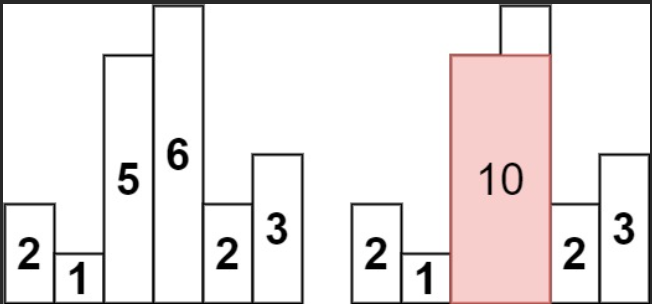
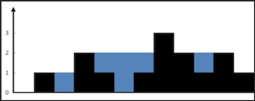

# 简介
栈，后进先出，适合DFS深度搜索等；队列，先进先出，适合BFS广度搜索等。但栈和队列的应用远不止DFS、BFS。

# Stack 栈
## [最小栈](https://leetcode-cn.com/problems/min-stack/)
```
设计一个支持 push ，pop ，top 操作，并能在常数时间内检索到最小元素的栈。
实现 MinStack 类:
MinStack() 初始化堆栈对象。
void push(int val) 将元素val推入堆栈。
void pop() 删除堆栈顶部的元素。
int top() 获取堆栈顶部的元素。
int getMin() 获取堆栈中的最小元素。
```
- 思路：栈中存的元素，不仅有当前插入的元素，还维护着当前插入时的最小值
```cpp
class MinStack {
private:
    stack<pair<int, int>> st;
public:
    MinStack() {}
    
    void push(int val) {
        if (st.empty()){
            st.push(make_pair(val, val));
        }else{
            st.push(make_pair(val, min(val, st.top().second)));
        }
    }
    
    void pop() {
        st.pop();
    }
    
    int top() {
        return st.top().first;
    }
    
    int getMin() {
        return st.top().second;
    }
};
```

## [逆波兰表达式求值](https://leetcode-cn.com/problems/evaluate-reverse-polish-notation/)
```
根据 逆波兰表示法，求表达式的值。两个整数之间的除法只保留整数部分。
```
- 思路：采用栈，遍历字符串，遇到数字入栈，遇到运算符，弹出两个数字，然后将运算结果再入栈。

```cpp
class Solution {
public:
    int _stoi(string& s){
        int ans = 0, base = 1, sign, stop;
        if (s[0] == '-'){
            sign = 0;
            stop = 1;
        }else if (s[0] == '+'){
            sign = 1;
            stop = 1;
        }else{
            sign = 1;
            stop = 0;
        }
        for (int i = s.size() - 1; i >= stop; --i){
            ans += (s[i] - '0') * base;
            base *= 10;
        }
        return (sign) ? ans : (-1) * ans;
    }

    int evalRPN(vector<string>& tokens) {
        stack<int> st;
        for (int i = 0; i < tokens.size(); ++i){
            if (tokens[i] == "+"){
                int n1 = st.top();
                st.pop();
                int n2 = st.top();
                st.pop();
                st.push(n2 + n1);
            }else if (tokens[i] == "-"){
                int n1 = st.top();
                st.pop();
                int n2 = st.top();
                st.pop();
                st.push(n2 - n1);
            }else if (tokens[i] == "*"){
                int n1 = st.top();
                st.pop();
                int n2 = st.top();
                st.pop();
                st.push(n2 * n1);
            }else if (tokens[i] == "/"){
                int n1 = st.top();
                st.pop();
                int n2 = st.top();
                st.pop();
                st.push(n2 / n1);
            }else{
                st.push(_stoi(tokens[i]));
            }
        }
        return st.top();
    }
};
```

## [字符串解码](https://leetcode-cn.com/problems/decode-string/)
```
给定一个经过编码的字符串，返回它解码后的字符串。
编码规则为: k[encoded_string]，表示其中方括号内部的 encoded_string 正好重复 k 次。注意 k 保证为正整数。
```
- 思路：为了方便，采用两个栈，一个用于存放数字，一个用于存放字符串。

```cpp
class Solution {
public:
    string decodeString(string s) {
        stack<string> strs;
        stack<int> nums;
        string temp_str = "";
        int temp_num = 0;
        for (int i = 0; i < s.size(); ++i){
            if (s[i] >= '0' && s[i] <= '9'){
                temp_num  = 10 * temp_num + (s[i] - '0');
            }else if(s[i] >= 'a' && s[i] <= 'z'){
                temp_str = temp_str + s[i];
            }else if (s[i] == '['){
                nums.push(temp_num);
                strs.push(temp_str);
                temp_num = 0;
                temp_str = "";
            }else{
                int mul = nums.top();
                nums.pop();
                for (int j = 0; j < mul; ++j){
                    strs.top() += temp_str;
                }
                temp_str = strs.top();
                strs.pop();
            }
        }
        return temp_str;
    }
};
```

## [二叉树的中序遍历](https://leetcode-cn.com/problems/binary-tree-inorder-traversal/)
详情见二叉树专题
```cpp
class Solution {
public:
    vector<int> inorderTraversal(TreeNode* root) {
        stack<TreeNode*> st;
        vector<int> res;
        if (!root){
            return res;
        }
        TreeNode* node = root;
        while (!st.empty() || node != nullptr){
            if (node != nullptr){
                st.push(node);
                node = node->left;
            }else{
                node = st.top();
                st.pop();
                res.push_back(node->val);
                node = node->right;
            }
        }
        return res;
    }
};
```

## [克隆图](https://leetcode-cn.com/problems/clone-graph/)
```
给你无向 连通 图中一个节点的引用，请你返回该图的 深拷贝（克隆）。
```
- BFS:
```cpp
class Solution {
public:
    Node* cloneGraph(Node* node) {
        if (!node) {return node;}
        unordered_map<Node*, Node*> visited;
        queue<Node*> q;
        q.push(node);
        visited[node] = new Node(node->val);
        while (!q.empty()){
            Node* temp = q.front();
            q.pop();
            for (auto& n:temp->neighbors){
                if (visited.find(n) == visited.end()){
                    visited[n] = new Node(n->val);
                    q.push(n);
                }
                visited[temp]->neighbors.emplace_back(visited[n]);
            }
        }
        return visited[node];
    }
};
```
- DFS:
```cpp
class Solution {
public:
    Node* cloneGraph(Node* node) {
        if (!node) {return node;}
        if (node->neighbors.size() == 0) {return new Node(node->val);}
        unordered_map<Node*, Node*> visited;
        visited[node] = new Node(node->val);
        stack<Node*> st;
        st.push(node);
        while (!st.empty()){
            Node* peek = st.top();
            if (visited[peek]->neighbors.size() == 0){
                for (auto& n : peek->neighbors){
                    if (visited.find(n) == visited.end()){
                        visited[n] = new Node(n->val);
                        st.push(n);
                    }
                    visited[peek]->neighbors.emplace_back(visited[n]);
                }
            }else{
                st.pop();
            }
        }
        return visited[node];
    }
};
```

## [岛屿数量]()
```
给你一个由 '1'（陆地）和 '0'（水）组成的的二维网格，请你计算网格中岛屿的数量。
岛屿总是被水包围，并且每座岛屿只能由水平方向和/或竖直方向上相邻的陆地连接形成。
此外，你可以假设该网格的四条边均被水包围。
```
- 思路：DFS，采用栈进行迭代（BFS也是可以的）
```cpp
class Solution {
public:
    void dfs(vector<vector<char>>& grid, int x, int y){
        stack<pair<int, int>> st;
        st.push(make_pair(x, y));
        while (!st.empty()){
            int temp_x = st.top().first;
            int temp_y = st.top().second;
            st.pop();
            if (grid[temp_x][temp_y] == '1'){
                grid[temp_x][temp_y] = '0';
                if (temp_x - 1 >= 0) {st.push(make_pair(temp_x - 1, temp_y));}
                if (temp_x + 1 < grid.size()) {st.push(make_pair(temp_x + 1, temp_y));}
                if (temp_y - 1 >= 0) {st.push(make_pair(temp_x, temp_y - 1));}
                if (temp_y + 1 < grid[0].size()) {st.push(make_pair(temp_x, temp_y + 1));}
            }
        }
    }

    void dfs(vector<vector<char>>& grid, int x, int y){
        if (grid[x][y] == '1'){
            grid[x][y] = '0';
            if (x - 1 >= 0) {dfs(grid, x - 1, y);}
            if (y - 1 >= 0) {dfs(grid, x, y - 1);}
            if (x + 1 < grid.size()) {dfs(grid, x + 1, y);}
            if (y + 1 < grid[0].size()) {dfs(grid, x, y + 1);}
        }
    } //递归版

    int numIslands(vector<vector<char>>& grid) {
        int ans = 0;
        for (int i = 0; i < grid.size(); ++i){
            for (int j = 0; j < grid[0].size(); ++j){
                if (grid[i][j] == '1'){
                    ++ans;
                    dfs(grid, i, j);
                }
            }
        }
        return ans;
    }
};
```
# 单调栈
顾名思义，单调栈即是栈中元素有单调性的栈，典型应用为用线性的时间复杂度找左右两侧第一个大于/小于当前元素的位置。
## [柱状图中最大的矩形](https://leetcode-cn.com/problems/largest-rectangle-in-histogram/)
```
给定 n 个非负整数，用来表示柱状图中各个柱子的高度。每个柱子彼此相邻，且宽度为 1 。
求在该柱状图中，能够勾勒出来的矩形的最大面积。
```

- 思路：单调栈（递增），我们需要找到下标i的左右两边第一个比自己矮的柱子的下标，遍历heights数组到[i]，将单调栈中高于自己的弹出，弹出的柱子右边第一个低于自己的柱子的下标即是i。i左边第一个低于自己的柱子的下标便为当前单调栈栈顶元素。
```cpp
class Solution {
public:
    int largestRectangleArea(vector<int>& heights) {
        int n = heights.size();
        vector<int> left(n, -1);
        vector<int> right(n, n);
        stack<int> st;
        for (int i = 0; i < n; ++i){
            while (!st.empty() && heights[st.top()] >= heights[i]){
                right[st.top()] = i;
                st.pop();
            }
            left[i] = (st.empty()) ? -1 : st.top();
            st.push(i);
        }
        int ans = 0;
        for (int i = 0; i < n; ++i){
            ans = max(ans, (right[i] - left[i] - 1) * heights[i]);
        }
        return ans;
    }
};
```

## [接雨水](https://leetcode-cn.com/problems/trapping-rain-water/)
```
给定 n 个非负整数表示每个宽度为 1 的柱子的高度图，计算按此排列的柱子，下雨之后能接多少雨水。
```



# Queue 队列
## [用栈实现队列](https://leetcode-cn.com/problems/implement-queue-using-stacks/)
```
请你仅使用两个栈实现先入先出队列。队列应当支持一般队列支持的所有操作（push、pop、peek、empty）：
实现 MyQueue 类：
void push(int x) 将元素 x 推到队列的末尾
int pop() 从队列的开头移除并返回元素
int peek() 返回队列开头的元素
boolean empty() 如果队列为空，返回 true ；否则，返回 false
```
```cpp
class MyQueue {
public:
    stack<int> st1, st2;

    MyQueue() {

    }
    
    void push(int x) {
        st1.push(x);
    }
    
    int pop() {
        while (!st1.empty()){
            st2.push(st1.top());
            st1.pop();
        }
        int rst = st2.top();
        st2.pop();
        while (!st2.empty()){
            st1.push(st2.top());
            st2.pop();
        }
        return rst;
    }
    
    int peek() {
        while (!st1.empty()){
            st2.push(st1.top());
            st1.pop();
        }
        int rst = st2.top();
        while (!st2.empty()){
            st1.push(st2.top());
            st2.pop();
        }
        return rst;
    }
    
    bool empty() {
        return st1.empty();
    }
};
```

## [二叉树的层序遍历](https://leetcode-cn.com/problems/binary-tree-level-order-traversal/)
详情见二叉树专题
```cpp
class Solution {
public:
    vector<vector<int>> levelOrder(TreeNode* root) {
        vector<vector<int>> res;
        if (!root) {return res;}
        queue<TreeNode*> q;
        q.push(root);
        while (!q.empty()){
            vector<int> temp;
            TreeNode* node;
            int n = q.size();
            for (int i = 0; i < n; ++i){
                node = q.front();
                q.pop();
                temp.push_back(node->val);
                if (node->left) {q.push(node->left);}
                if (node->right) {q.push(node->right);}
            }
            res.push_back(temp);
        }
        return res;
    }
};
```

## [01矩阵](https://leetcode-cn.com/problems/01-matrix/)
```
给定一个由 0 和 1 组成的矩阵 mat ，请输出一个大小相同的矩阵，其中每一个格子是 mat 中对应位置元素到最近的 0 的距离。
两个相邻元素间的距离为 1 。
```
- 思路1：初始化，若该位置不为0，则距离为INT_MAX；若为0，则距离为0，并将0所在的位置入队列。当队列不空时，弹出队头元素，遍历其四个邻居，若距离可更新，则更新，并将新位置入队，否则，continue循环

```cpp
class Solution {
public:
    vector<vector<int>> updateMatrix(vector<vector<int>>& mat) {
        int m = mat.size(), n = mat[0].size();
        vector<vector<int>> ans(m, vector<int> (n));
        queue<pair<int, int>> q;
        for (int i = 0; i < m; ++i){
            for (int j = 0; j < n; ++j){
                if (mat[i][j] == 0){
                    ans[i][j] = 0;
                    q.push(make_pair(i, j));
                }else{
                    ans[i][j] = INT_MAX;
                }
            }
        }
        vector<pair<int, int>> directions = {make_pair(0, 1), make_pair(0, -1), make_pair(1, 0), make_pair(-1, 0)};
        while (!q.empty()){
            int x = q.front().first, y = q.front().second;
            q.pop();
            for (auto& d : directions){
                int dx = d.first, dy = d.second;
                int new_x = x + dx, new_y = y + dy;
                if (new_x >=0 && new_x < m && new_y >= 0 && new_y < n){
                    if (ans[new_x][new_y] > ans[x][y] + 1){
                        ans[new_x][new_y] = ans[x][y] + 1;
                        q.push(make_pair(new_x, new_y));
                    }
                }
                
            }
        }
        return ans;
    }
};
```
- 思路2：两个方向（左上到右下，右下到左上）的DP

```cpp
class Solution {
public:
    vector<vector<int>> updateMatrix(vector<vector<int>>& mat) {
        int m = mat.size(), n = mat[0].size();
        vector<vector<int>> ans(m, vector<int> (n));
        for (int i = 0; i < m; ++i){
            for (int j = 0; j < n; ++j){
                if (mat[i][j] == 0){
                    ans[i][j] = 0;
                }else{
                    ans[i][j] = INT_MAX - 1;
                }
            }
        }
        for (int i = 0; i < m; ++i){
            for (int j = 0; j < n; ++j){
                if (i - 1 >= 0){
                    ans[i][j] = min(ans[i][j], ans[i - 1][j] + 1);
                }
                if (j - 1 >= 0){
                    ans[i][j] = min(ans[i][j], ans[i][j - 1] + 1);
                }
            }
        }
        for (int i = m - 1; i >= 0; --i){
            for (int j = n - 1; j >= 0; --j){
                if (i + 1 < m){
                    ans[i][j] = min(ans[i][j], ans[i + 1][j] + 1);
                }
                if (j + 1 < n){
                    ans[i][j] = min(ans[i][j], ans[i][j + 1] + 1);
                }
            }
        }
        return ans;
    }
};
```

